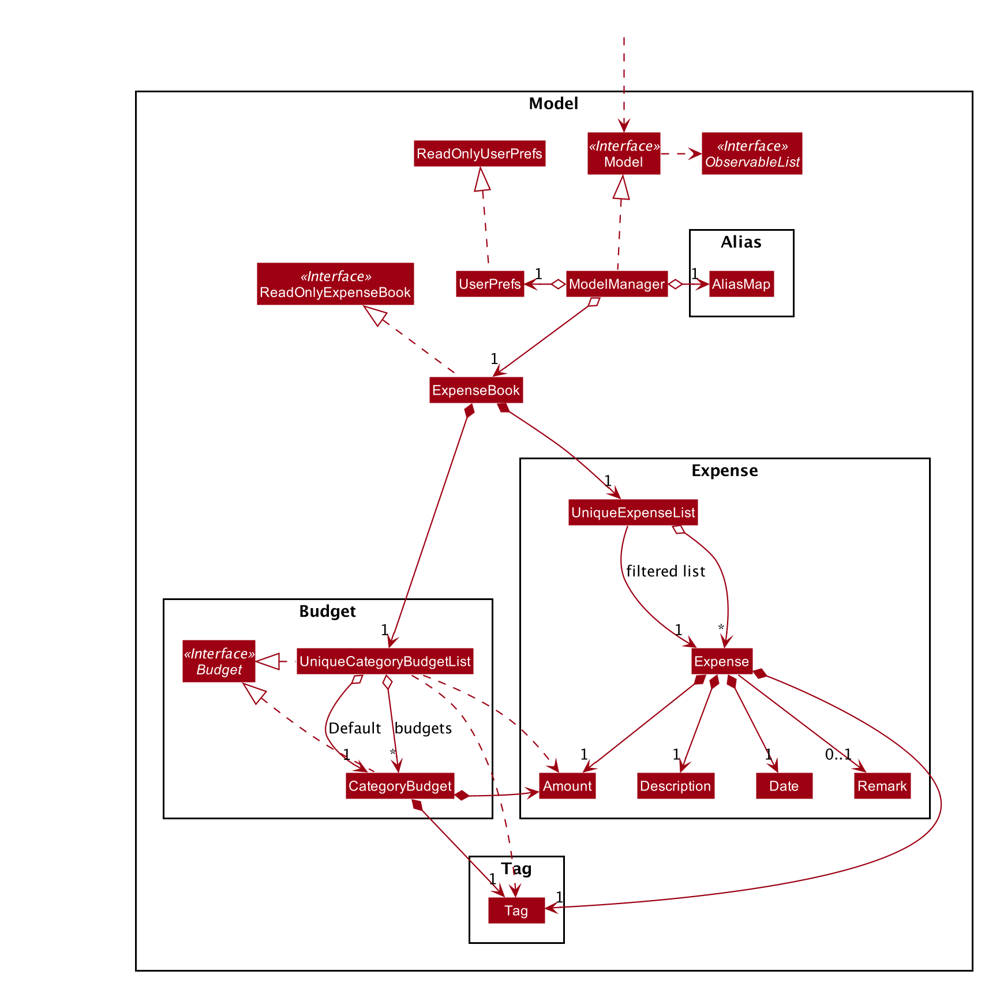
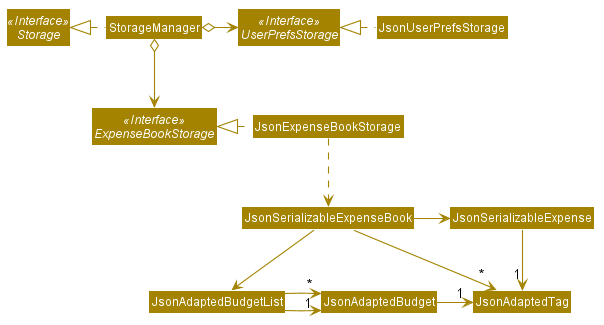
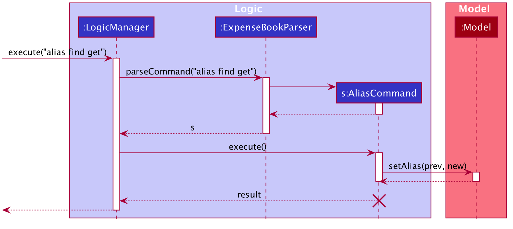
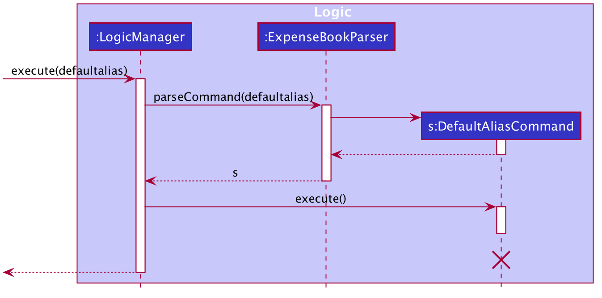
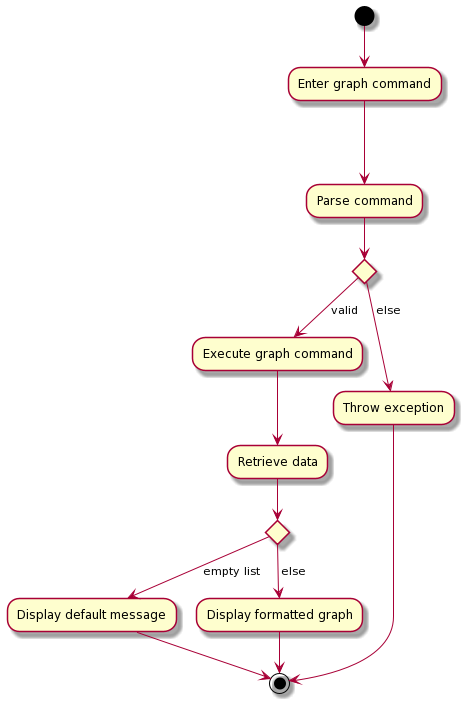

* Table of Contents
{:toc}

--------------------------------------------------------------------------------------------------------------------

## **Setting up, getting started**

Refer to the guide [_Setting up and getting started_](SettingUp.md).

--------------------------------------------------------------------------------------------------------------------

## **Design**

### Architecture

The ***Architecture Diagram*** given above explains the high-level design of the App. Given below is a quick overview of each component.

:bulb: **Tip:** The `.puml` files used to create diagrams in this document can be found in the [diagrams](https://github.com/AY2021S1-CS2103-W14-3/tp/tree/master/docs/diagrams/) folder. Refer to the [_PlantUML Tutorial_ at se-edu/guides](https://se-education.org/guides/tutorials/plantUml.html) to learn how to create and edit diagrams.

**`Main`** has two classes called [`Main`](https://github.com/AY2021S1-CS2103-W14-3/tp/tree/master/src/main/java/seedu/expense/Main.java) and [`MainApp`](https://github.com/AY2021S1-CS2103-W14-3/tp/tree/master/src/main/java/seedu/expense/MainApp.java). It is responsible for,
* At app launch: Initializes the components in the correct sequence, and connects them up with each other.
* At shut down: Shuts down the components and invokes cleanup methods where necessary.

[**`Commons`**](#common-classes) represents a collection of classes used by multiple other components.

The rest of the App consists of four components.

* [**`UI`**](#ui-component): The UI of the App.
* [**`Logic`**](#logic-component): The command executor.
* [**`Model`**](#model-component): Holds the data of the App in memory.
* [**`Storage`**](#storage-component): Reads data from, and writes data to, the hard disk.

Each of the four components,

* defines its *API* in an `interface` with the same name as the Component.
* exposes its functionality using a concrete `{Component Name}Manager` class (which implements the corresponding API `interface` mentioned in the previous point.

For example, the `Logic` component (see the class diagram given below) defines its API in the `Logic.java` interface and exposes its functionality using the `LogicManager.java` class which implements the `Logic` interface.

**How the architecture components interact with each other**

The *Sequence Diagram* below shows how the components interact with each other for the scenario where the user issues the command `delete 1`.

The sections below give more details of each component.

### UI component

**API** :
[`Ui.java`](https://github.com/AY2021S1-CS2103-W14-3/tp/tree/master/src/main/java/seedu/expense/ui/Ui.java)

The UI consists of a `MainWindow` that is made up of parts e.g.`CommandBox`, `ResultDisplay`, `ExpenseListPanel`, `StatusBarFooter` etc. All these, including the `MainWindow`, inherit from the abstract `UiPart` class.

The `UI` component uses JavaFx UI framework. The layout of these UI parts are defined in matching `.fxml` files that are in the `src/main/resources/view` folder. For example, the layout of the [`MainWindow`](https://github.com/AY2021S1-CS2103-W14-3/tp/tree/master/src/main/java/seedu/expense/ui/MainWindow.java) is specified in [`MainWindow.fxml`](https://github.com/AY2021S1-CS2103-W14-3/tp/tree/master/src/main/resources/view/MainWindow.fxml)

The `UI` component,

* Executes user commands using the `Logic` component.
* Listens for changes to `Model` data so that the UI can be updated with the modified data.

### Logic component

**API** :
[`Logic.java`](https://github.com/AY2021S1-CS2103-W14-3/tp/tree/master/src/main/java/seedu/expense/logic/Logic.java)

1. `Logic` uses the `ExpenseBookParser` class to parse the user command.
1. This results in a `Command` object which is executed by the `LogicManager`.
1. The command execution can affect the `Model` (e.g. adding a expense).
1. The result of the command execution is encapsulated as a `CommandResult` object which is passed back to the `Ui`.
1. In addition, the `CommandResult` object can also instruct the `Ui` to perform certain actions, such as displaying help to the user.

Given below is the Sequence Diagram for interactions within the `Logic` component for the `execute("delete 1")` API call.

:information_source: **Note:** The lifeline for `DeleteCommandParser` should end at the destroy marker (X) but due to a limitation of PlantUML, the lifeline reaches the end of diagram.

### Model component

**API** : [`Model.java`](https://github.com/AY2021S1-CS2103-W14-3/tp/tree/master/src/main/java/seedu/expense/model/Model.java)

The `Model`,

* stores a `UserPref` object that represents the user’s preferences.
* stores the expense book data.
* exposes an unmodifiable `ObservableList<Expense>` that can be 'observed' e.g. the UI can be bound to this list so that the UI automatically updates when the data in the list change.
* does not depend on any of the other three components.

:information_source: **Note:** An alternative (arguably, a more OOP) model is given below. It has a `Tag` list in the `ExpenseBook`, which `Expense` references. This allows `ExpenseBook` to only require one `Tag` object per unique `Tag`, instead of each `Expense` needing their own `Tag` object. 

### Storage component

**API** : [`Storage.java`](https://github.com/AY2021S1-CS2103-W14-3/tp/tree/master/src/main/java/seedu/expense/storage/Storage.java)

The `Storage` component,
* can save `UserPref` objects in json format and read it back.
* can save the expense book data in json format and read it back.

### Common classes

Classes used by multiple components are in the `seedu.expense.commons` package.

--------------------------------------------------------------------------------------------------------------------

## **Implementation**

This section describes some noteworthy details on how certain features are implemented.

### \[Proposed\] Undo/redo feature

#### Proposed Implementation

The proposed undo/redo mechanism is facilitated by `VersionedExpenseBook`. It extends `ExpenseBook` with an undo/redo history, stored internally as an `expenseBookStateList` and `currentStatePointer`. Additionally, it implements the following operations:

* `VersionedExpenseBook#commit()` — Saves the current expense book state in its history.
* `VersionedExpenseBook#undo()` — Restores the previous expense book state from its history.
* `VersionedExpenseBook#redo()` — Restores a previously undone expense book state from its history.

These operations are exposed in the `Model` interface as `Model#commitExpenseBook()`, `Model#undoExpenseBook()` and `Model#redoExpenseBook()` respectively.

Given below is an example usage scenario and how the undo/redo mechanism behaves at each step.

Step 1. The user launches the application for the first time. The `VersionedExpenseBook` will be initialized with the initial expense book state, and the `currentStatePointer` pointing to that single expense book state.

Step 2. The user executes `delete 5` command to delete the 5th expense in the expense book. The `delete` command calls `Model#commitExpenseBook()`, causing the modified state of the expense book after the `delete 5` command executes to be saved in the `expenseBookStateList`, and the `currentStatePointer` is shifted to the newly inserted expense book state.

Step 3. The user executes `add n/David …​` to add a new expense. The `add` command also calls `Model#commitExpenseBook()`, causing another modified expense book state to be saved into the `expenseBookStateList`.

:information_source: **Note:** If a command fails its execution, it will not call `Model#commitExpenseBook()`, so the expense book state will not be saved into the `expenseBookStateList`.

Step 4. The user now decides that adding the expense was a mistake, and decides to undo that action by executing the `undo` command. The `undo` command will call `Model#undoExpenseBook()`, which will shift the `currentStatePointer` once to the left, pointing it to the previous expense book state, and restores the expense book to that state.

:information_source: **Note:** If the `currentStatePointer` is at index 0, pointing to the initial ExpenseBook state, then there are no previous ExpenseBook states to restore. The `undo` command uses `Model#canUndoExpenseBook()` to check if this is the case. If so, it will return an error to the user rather
than attempting to perform the undo.

The following sequence diagram shows how the undo operation works:

:information_source: **Note:** The lifeline for `UndoCommand` should end at the destroy marker (X) but due to a limitation of PlantUML, the lifeline reaches the end of diagram.

The `redo` command does the opposite — it calls `Model#redoExpenseBook()`, which shifts the `currentStatePointer` once to the right, pointing to the previously undone state, and restores the expense book to that state.

:information_source: **Note:** If the `currentStatePointer` is at index `expenseBookStateList.size() - 1`, pointing to the latest expense book state, then there are no undone ExpenseBook states to restore. The `redo` command uses `Model#canRedoExpenseBook()` to check if this is the case. If so, it will return an error to the user rather than attempting to perform the redo.

Step 5. The user then decides to execute the command `list`. Commands that do not modify the expense book, such as `list`, will usually not call `Model#commitExpenseBook()`, `Model#undoExpenseBook()` or `Model#redoExpenseBook()`. Thus, the `expenseBookStateList` remains unchanged.

Step 6. The user executes `clear`, which calls `Model#commitExpenseBook()`. Since the `currentStatePointer` is not pointing at the end of the `expenseBookStateList`, all expense book states after the `currentStatePointer` will be purged. Reason: It no longer makes sense to redo the `add n/David …​` command. This is the behavior that most modern desktop applications follow.

The following activity diagram summarizes what happens when a user executes a new command:

#### Design consideration:

##### Aspect: How undo & redo executes

* **Alternative 1 (current choice):** Saves the entire expense book.
  * Pros: Easy to implement.
  * Cons: May have performance issues in terms of memory usage.

* **Alternative 2:** Individual command knows how to undo/redo by
  itself.
  * Pros: Will use less memory (e.g. for `delete`, just save the expense being deleted).
  * Cons: We must ensure that the implementation of each individual command are correct.

_{more aspects and alternatives to be added}_

### \[Proposed\] Category account switching feature

#### Proposed Implementation

The proposed switching mechanism is facilitated by `CategoryExpenseBook`. It extends `ExpenseBook` with a tag-matching method. Additionally, it implements the following operations:

* `CategoryExpenseBook#matchTag(Tag category)` — Checks if the given tag matches the tag of category budget.

These operations are exposed in the `Model` interface as `Model#switchExpenseBook(Tag category)`
Given below is an example usage scenario and how the switching mechanism behaves at each step.

Step 1. The user launches the application for the first time. The `CategoryExpenseBook` will be initialized with the initial expense book state.

Step 2. The user executes `switch t/Food` command to switch to CategoryExpenseBook with "Food" tag in category budget in the expense book. The `switch` command calls `Model#switchExpenseBook()`, causing the filteredExpenses to be modified.

The following sequence diagram shows how the switch operation works:

:information_source: **Note:** The lifeline for `SwitchCommand` should end at the destroy marker (X) but due to a limitation of PlantUML, the lifeline reaches the end of diagram.

Step 3. The user then decides to execute the command `topup`. Commands that modify the expense book, such as `topup`, `delete`, `edit`, will usually call their respectively method in Model. Thus, the `expenseBookStateList` remains unchanged.

Step 4. The user then decides to execute the command `list`. Commands that do not modify the expense book, such as `list`, will usually revert the display view to initial expensebook`. Thus, the `expenseBookStateList` remains unchanged.

#### Design consideration:

##### Aspect: How category switching executes

* **Alternative 1 (current choice):** Filters the entire expense book by tag.
  * Pros: Easy to implement.
  * Cons: May have performance issues in terms of execution speed.

* **Alternative 2:** Create multiple expense books for each category.
  * Pros: Will be faster during execution.
  * Cons: Slower initialisation and more memory used.

### \[Proposed\] Customisation of Command Keywords

#### Proposed Implementation

The proposed implementation for the customisation of `COMMAND_WORD` field for various `Command` subclasses is by introducing another `Command` subclass, called the `AliasCommand`. This command takes in a command keyword that the user wishes to alter, and takes a second keyword which determines what the new COMMAND_WORD for the stated `Command` subclass would be. To allow for customisation to remain even after the app is closed, a customised keyword-to-command mapping will be stored in JSON format. Upon starting the app, the static field `COMMAND_WORD` will be initialized for each command.

Sample usage:
By default, `FindCommand.COMMAND_WORD` is `“find”`

* `alias find get` -> `FindCommand.COMMAND_WORD` will be updated to `“get”`

This mapping will also be stored in an external JSON so that the customisation remains even after the app is closed. 

To maintain some degree of simplicity and neatness, we require that the `AliasCommand.COMMAND_WORD` itself to not be customisable. Furthermore, the user also has the ability to revert the command keywords back to their default using the `DefaultAliasCommand` with the default `COMMAND_WORD` as `defaultalias`. This is made a little longer and slightly more complicated to input because this will override the entire customisation to default and user will not be able to retrieve his previous customisations. Like the AliasCommand, `DefaultAliasCommand.COMMAND_WORD` itself is not customisable.

Another change required here is for the COMMAND_WORD fields to not be final, except for AliasCommand and DefaultAliasCommand. This will allow changes to a COMMAND_WORD field to be reflected directly in the current running instance of the application.

Step 1. The user launches the application for the first time. The `COMMAND_WORD` static fields for all the subclasses will be initialized to the current mapping retrieved from JSON.

Step 2. The user executes the `alias find get` command to update the current `FindCommand.COMMAND_WORD` from `”find”’ to `”get”`.  This will not only update the current state, but will also update the JSON mapping.

The following is a sequence diagram showing how it works:

Similarly, the following sequence diagram shows how the DefaultAliasCommand works:

Step 3. The user can now use the following command to trigget a FindCommand.

* `get -d lunch at macs`
#### Design consideration:

##### Aspect: How alias executes
* **Alternative 1 (current choice):** Allows customisation of all command words except for `AliasCommand` and `DefaultAliasCommand`.
  * Pros: Neater implementation especially if the user might frequently change his alias, and DefaultAliasCommand has a long default and uncustomisable command word in order to prevent accidental reset of previous customisations.
  * Cons: Restricts degree of customisation.

* **Alternative 2:** Allows customisation of ALL command words.
  * Pros: Higher degree of flexibility in customisation.
  * Cons: May be messy and slower learning users may get confused.
_{more aspects and alternatives to be added}_

### \[Proposed\] Default Category

The function of the default category is to subsume all "untagged" `expenses` under some category.
This is especially important for possible occasions such as when the User uses the application without any categories,
or when the User deletes a category that existing `expenses` are linked to.

#### Proposed Implementation

The default category generally functions the same way as any user-created category, except that it cannot be deleted or
renamed. It is contained separately from the user-created categories (if any) for this reason. If a new ExpenseBook is
started, the default category is automatically initialized so that the User can use the full range of the basic
features even without creating customized categories.

### \[Proposed\] Graphical Representation Feature

#### Proposed Implementation

The proposed graphical representation feature will allow the user to view a pie chart of his total spending, with each wedge representing the percentage of spending that corresponds to a specific tag.
This graphical representation will be displayed on `GraphDisplayWindow` upon the execution of `GraphCommand`. This mechanism will be facilitated by `PieChartData` to retrieve the required data from `ExpenseBook`.
`PieChartData` extends `ChartData` which allows abstracting out the implementation of different graphical representation formats for future versions.

* `PieChartData#collectData(ObservableList<Expense>)` — Retrieves required data.
* `PieChartData#getData()` — Returns data of each `Tag` and the corresponding total expenditure.

The interactions between `ExpenseBook` (which contains the in-memory data of expenses) and `GraphicalDisplayWindow` (which specifies the UI displayed) facilitated by `PieChartData` is given below.  

The user initiates this function by executing the graph command. Refer Logic Component architecture diagram for the mechanism by which strings are read and parsed into Command objects.

The sequence diagram below shows the proposed mechanism by which the required data necessary to initialise a pie chart is retrieved. This data is then used to format the UI output.

:information_source: **Note:** Expenses that are untagged will be displayed as a single group. Tags should not be case sensitive.

A possible edge case would be the user having empty expense record prior to executing the graph command. In such a case, the program will display a default message.

The following activity diagram summarizes what happens when a user enters a graph command:

#### Points to Note:

* **UI classes to only act as placeholders**
  * UI formatting is separated from the backend logic.
  * Allows for dynamic updating of graphs.

* **Data re-retrieved upon every execution**
  * Updates graph accordingly.
  * Will not show outdated graphs.

* **Easily extensible**
  * Different sub-classes of `ChartData` can be implemented to collect a variety of meaningful data from `ExpenseBook` to be displayed by various UI classes in different formats.

--------------------------------------------------------------------------------------------------------------------

## **Documentation, logging, testing, configuration, dev-ops**

* [Documentation guide](Documentation.md)
* [Testing guide](Testing.md)
* [Logging guide](Logging.md)
* [Configuration guide](Configuration.md)
* [DevOps guide](DevOps.md)

--------------------------------------------------------------------------------------------------------------------

## **Appendix: Requirements**

### Product scope

**Target user profile**:

* is a college student
* spends money mainly on food, transportation, social life and material goods
* wants to keep track of his personal expenses
* considers oneself as "tech-folk"
* is familiar and comfortable with the command line
* types fast
* wants to set and keep to a budget
* likes things that are fast and simple
* is attached
* pays for his own bills
* is all for cashless
* is cautious about digital security
* prefers storing things digitally rather than on paper
* likes flexibility/customization
* plays games and likes achievements
* is not earning income
* is lazy enough to find a solution to manage his expenses for him

**Value proposition**: manage expenses faster and simpler than a typical mouse/GUI driven app

### User stories

Priorities: High (must have) - `* * *`, Medium (nice to have) - `* *`, Low (unlikely to have) - `*`

| Priority | As a …​                                    | I want to …​                                                                                 | So that I can…​                                                        |
| -------- | ------------------------------------------ | ---------------------------------------------------------------------------------------------------- | ---------------------------------------------------------------------- |
| `* * *`  | user                                       | add a new expense                                                                                    |                                                                        |
| `* * *`  | user                                       | delete an expense                                                                                    | remove entries that I no longer need                                   |
| `* * *`  | user                                       | set a budget                                                                                         | track if I am sticking to my financial goals                           |
| `* * *`  | user                                       | top up a budget                                                                                      |                                                                        |
| `* * *`  | user                                       | edit an expense                                                                                      |                                                                        |
| `* *`    | organized user                             | categorise my expenditure                                                                            | better manage specific aspects of my spending                          |
| `* *`    | new user                                   | use a help command                                                                                   | refer to instructions when I forget how to use the App                 |
| `* *`    | cautious user                              | set a password for Bamboo                                                                            | keep my expenses private                                               |
| `* *`    | user with many expenses                    | find expenses via date, keywords, or category                                                        | locate an expense easily                                               |
| `* *`    | careless user                              | revert my commands                                                                                   | easily undo changes I made to my budgeting                             |
| `*`      | meticulous user                            | track my saving progress to buy big ticket items                                                     | know how far away am I from the target                                 |
| `*`      | user who likes to see progress             | use the progress tracker to motivate myself                                                          | keep working at saving up                                              |
| `*`      | cautious user                              | view my ledger data in a human-readable format and only edit the file when commands are executed     | be assured that the accounts are updated and accurate                  |
| `*`      | long-time user                             | archive older data from my view                                                                      | manage my expenses easier                                              |
| `stretch`| user who likes to plan in advance          | simulate future spending                                                                             | visualize my journey towards my financial goals                        |
| `stretch`| forgetful user                             | receive notifications of budget limits and bill payments                                             | better plan for daily expenditure and make payments on time            |

*{More to be added}*

### Use cases

(For all use cases below, the System is the Bamboo and the Actor is the user, unless specified otherwise)

####Use case U1: Add an expense

**Preconditions:** (Needed for v1.2.1)

* User is logged in.

**MSS**

1. User requests to add an expense.
2. Bamboo adds the expense.
3. Bamboo lists all expenses and shows the new budget balance.

    Use case ends.

**Extensions**

* 1a. The given command format is invalid.
    * 1a1. Bamboo shows an error message.
      Use case ends.

####Use case U2: Top-up budget

**Preconditions:** (Needed for v1.2.1)

- User is logged in.

**MSS**

1. User requests to top up budget by an amount he provides.
2. Bamboo tops up the user's budget by the amount given by the user.
3. Bamboo lists all expenses and shows the budget balance.

    Use case ends.

**Extensions**

* 1a. The given top-up value is invalid.
    * 1a1. Bamboo shows an error message.
      Use case ends.

####Use case U3: Delete an expense

**Preconditions:** (Needed for v1.2.1)

* User is logged in.

**MSS**

1. User requests to list expenses (U5).
2. Bamboo shows a list of expenses.
3. User requests to delete a specific expense in the list.
4. Bamboo deletes the expense.
5. Bamboo lists all expenses and shows the budget balance.

   Use case ends.

**Extensions**

* 2a. The list is empty.

  Use case ends.

* 3a. The given expense does not exist.
    * 3a1. Bamboo shows an error message.

      Use case resumes at step 2.

####Use case U4: Edit an expense

**Preconditions:** (Needed for v1.2.1)

* User is logged in.

**MSS**

1. User requests to list expenses (U5).
2. Bamboo shows a list of expenses.
3. User requests to edit an expense with the new fields given.
4. Bamboo edits the expense.
5. Bamboo feedbacks to user what was changed.
6. Bamboo lists all expenses and shows the new budget balance.
   Use case ends.

**Extensions**

* 2a. The list is empty.
    * 2a1. Bamboo shows an error message
      Use case ends
* 3a. The given field value is invalid.
    * 3a1. Bamboo shows an error message.
      Use case ends.

####Use case U5: List all expenses

**Preconditions:** (Needed for v1.2.1)

* User is logged in.

**MSS**

1. User requests to list all expenses.
2. Bamboo shows a list of all expenses recorded and the current budget balance.

   Use case ends.

####Use case U6: Add a remark to an expense

**Preconditions:** (Needed for v1.2.1)
* User is logged in.
* Expense List is not empty.

**MSS**
1. User requests to add a remark to specified expense item.
2. Bamboo adds remark to specified expense item.
3. Bamboo lists all expenses and shows the budget balance.
   Use case ends.

**Extensions**

* 1a. The given expense does not exist.
    * 1a1. Bamboo shows an error message.
    Use case ends.

####Use case U7: Find an expense

**Preconditions:** (Needed for v1.2.1)

* User is logged in.

**MSS**

1. User requests to find expense by certain identifiers and search terms.
2. Bamboo shows a list of expenses which match the identifiers and search terms.
3. Bamboo lists all expenses and shows the new budget balance.
   Use case ends.

**Extensions**

* 1a. The given field values are invalid.
    * 1a1. Bamboo shows an error message.
      Use case ends.

### Non-Functional Requirement

Project Constraints:

* Product does not handle user's actual financial account
* User input in the form of command line
* System should be beginner-friendly
* User's spending data should be saved in an external storage file
* Storage file should be updated after each addition or update of spending data
* Product is offered as an offline application

Process Requirements:

* Project is expected to adhere to the set Milestones.
* User can execute actions using at most 1 command.

### Glossary

- **Mainstream OS**: Windows, Linux, Unix, OS-X
- **Expense**: A single instance of expenditure containing a description, amount spent, date, and category. Expenses are subtracted from the user's **budget**.
- **Budget**: The amount a user sets aside to spend.
- **Budget Balance**: The amount of budget left after deducting all expenses.

--------------------------------------------------------------------------------------------------------------------

## **Appendix: Instructions for manual testing**

Given below are instructions to test the app manually.

:information_source: **Note:** These instructions only provide a starting point for testers to work on;
testers are expected to do more *exploratory* testing.

### Launch and shutdown

1. Initial launch

   1. Download the jar file and copy into an empty folder

   1. Double-click the jar file Expected: Shows the GUI with a set of sample contacts. The window size may not be optimum.

1. Saving window preferences

   1. Resize the window to an optimum size. Move the window to a different location. Close the window.

   1. Re-launch the app by double-clicking the jar file. 
       Expected: The most recent window size and location is retained.

1. _{ more test cases …​ }_

### Deleting an expense

1. Deleting an expense while all expenses are being shown

   1. Prerequisites: List all expenses using the `list` command. Multiple expenses in the list.

   1. Test case: `delete 1` 
      Expected: First contact is deleted from the list. Details of the deleted contact shown in the status message. Timestamp in the status bar is updated.

   1. Test case: `delete 0` 
      Expected: No expense is deleted. Error details shown in the status message. Status bar remains the same.

   1. Other incorrect delete commands to try: `delete`, `delete x`, `...` (where x is larger than the list size) 
      Expected: Similar to previous.

1. _{ more test cases …​ }_

### Saving data

1. Dealing with missing/corrupted data files

   1. _{explain how to simulate a missing/corrupted file, and the expected behavior}_

1. _{ more test cases …​ }_
