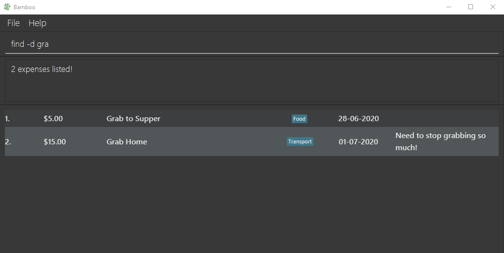

# User Guide

Bamboo (v1.2) is a **simple desktop app for managing personal finance, optimized for use via a Command Line Interface (CLI),** and targeted at college students. If you can type fast, Bamboo v1.2 can get your financial management tasks done faster than traditional GUI apps.

---

## Table of content

1. [Quick Start](#QuickStart)
2. [Features](#Features)
3. [Usage](#Usage)
4. [Command Summary](#CommandSummary)

## Quick Start 

1. Download Java Version 11
2. Download [Bamboo v1.2](https://github.com/AY2021S1-CS2103-W14-3/tp/releases/tag/v1.2). 

## Features 

1. **Add**
    - Adds new expense record.
    - Command: `add`
    - [API](#add)

2. **List**
    - Displays a list of the all the user's expenses.
    - Command: `list`
    - [API](#list)

3. **Update**
    - Edits existing expense record.
    - Command: `edit`
    - [API](#edit)

4. **Delete**
    - Deletes a specified existing expense record.
    - Command: `delete`
    - [API](#delete)

5. **Top up budget**
    - Increases budget by amount input by user .
    - Expenses are subtracted from the budget.
    - Command: `topup`
    - [API](#topup)

6. **Category tagging**
    - Tags expenses by their categories
    - Prefix: `t/`
    - [API](#tag)
    
7. **Expense finding**
    - Finds expenses by keywords, date, tags 
    - Command: 'find'
    - [API](#find)    
    
8. **Adding Remark**
    - Adds a remark to an existing expense
    - Command: 'remark"
    -[API](#remark)
         
9. Save Load Function &lt;Coming Soon v1.2.1&gt;
10. Password &lt;Coming Soon v1.2.1&gt;
11. Help command → documentation &lt;Coming Soon v1.2.1&gt;
12. Sorting (date, category, keyword, amount) &lt;Coming Soon v1.2.1&gt;
13. Multiple Accounts &lt;pending&gt;
14. GUI &lt;pending&gt;>
15. Budget notifications &lt;pending&gt;
16. Achievements &lt;pending&gt;
17. Graphs and progress trackers &lt;pending&gt;
18. Colours &lt;pending&gt;
18. Sort/Search more powerful &lt;pending&gt;
20. Customisation of workflow → shortcuts etc. &lt;pending&gt;
21. Simulation of spending &lt;pending&gt;

## Usage/ API 
### Commands
1. **add** 
    - Date input (DD-MM-YYYY) is optional, defaults to system's date.
    - Order of arguments is flexible.
    - Able to add multiple tags
    - Format: `add -d<description> -$<amount_spent> [-@<date>] [t/<category>]`
    - Example: `add -ddinner -$10.50` Adds the spending to **current date's** record
    - Example: `add -ddinner -$10.50 -@24-06-2020 t/Food` Adds the spending to **input date's** record and tags with **input category**
    - Example: `add -ddinner -$10.50 -@20-08-2020 t/Food t/Basic` Adds the spending to **input date's** record and tags with **input categories**

     

2. **list** 
    - Format: `list`
    - Example: `list` Displays all the items in the list.

     

3. **edit** 
    - Identified by index starting from 1.
    - Order of arguments is flexible except index.
    - Edited fields overwrite previous field completely. 
    - **At least 1, and up to all 3**, fields (description, amount spent, date) of expense must be specified.
    - Format: `edit <index> [-d<description>] [-$<amount_spent>] [-@<date>] [t/<category>]`
    - Example: `edit 1 -dlunch -$12.50`
    - Example: `edit 11 -$12.50 -dlunch -@23-06/2020 t/Food`
    
     

4. **delete** 
    - Deletes a specified existing expense record.
    - Identified by index starting from 1.
    - Format:  `delete <index>`
    - Example: `delete 11` Deletes the item at index 11 of the list.
    
     

5. **topup** 
    - Increases budget by amount input by user .
    - Expenses are subtracted from the budget.
    - Format: `topup -$<amount>`
    - Example: `topup -$10` Adds an extra budget of 10 dollars to work with.
    
     
    
6. **find** 
    - Finds expenses with given keywords, date, category by user.
    - Expenses that fits the criteria will be presented as another list.
    - Keywords and category are case-sensitive.
    - Format: `find [-d<description>] [-@<date>] [t/<category>]`
    - Example: `find -dPhone`, `find -dlunch -@01-07-2020 t/Food`
    
         

7. **remark** 
    - Adds a remark to an existing expense.
    - Format: `remark <index> r/<remark>`
    - Example: `remark 11 r/Pepper Lunch`
    
       
     
### Fields
1. **description**
    - Description of expense made.
    - Works only in complement with [add](#add), [edit](#edit), [find](#find)
    - Prefix: `-d`
    - Format: `-d<description>`
    - Example: `-dlunch`, `-ddinner`
    
2. **amount**
    - Amount of expense made
    - Works only in complement with [add](#add), [edit](#edit), [find](#find), [topup](#topup)
    - Prefix: `-$`
    - Format: `-$<amount>`
    - Example: `-$2`, `-$1.50`
    
3. **date**
    - Date at which expense was made
    - Works only in complement with [add](#add), [edit](#edit), [find](#find)
    - Prefix: `-@`
    - Format: `-@<DD-MM-YYYY>`
    - Example: `-@01-07-2020`, `-@02-07-2020`

4. **tag** 
    - Tags expense by a category input by user
    - Works only in complement with [add](#add), [edit](#edit), [find](#find)
    - An expense can have multiple tags
    - Format: `t/<category>`
    - Example: `edit t/Food`, `find -dCoffee t/Food`

## Command summary 

|   Action   | Format, Examples                                                                                                                                              |
|------------|---------------------------------------------------------------------------------------------------------------------------------------------------------------|
|  **Add**   | `add -d<description> -$<amount_spent> [-@<date>] [t/<category>]`   e.g., `add -ddinner -$10.50`, `add -ddinner -$10.50 -@20-08-2020 t/Food`                |
|  **List**  | `list`                                                                                                                                                        |
|  **Edit**  | `edit <index> [-d<description>] [-$<amount_spent>] [-@<date>] [t/<category>]`  e.g.,`edit 1 -dlunch -$12.50`, `edit 1 -$12.50 -dlunch -@11-11/2020 t/Lunch`|
| **Delete** | `delete <index>`  e.g., `delete 1`                                                                                                                         |
| **Topup**  | `topup -$<amount>`  e.g., `topup -$200`                                                                                                                    |
|  **Find**  | `find [-d<description>] [-@<date>] [t/<category>]`   e.g., `find -dlunch`, `find -dlunch -@01-07-2020 t/Food`                                              |
| **Remark** | `remark <index> r/<remark>`   e.g., `remark 11 r/Pepper Lunch`                                                                                             |
